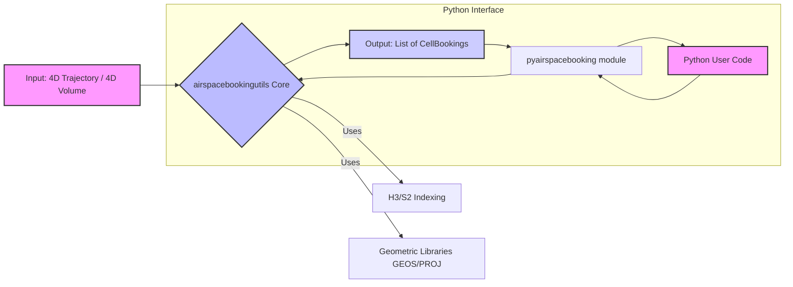

# Airspace Booking Utils (`airspacebookingutils`)

## Overview

`airspacebookingutils` is a C++ library with Python bindings designed for efficient calculation of airspace cell bookings. It determines which discrete airspace cells (using H3 or S2 spatial indexing) are occupied by a given 4D trajectory or a 4D volumetric definition. This is useful for applications in air traffic management, drone operations, and airspace planning.

## Features

*   **Spatial Indexing:** Supports both H3 (hexagonal) and S2 (quadrilateral) cell indexing.
*   **Dimensionality:** Provides functions for both 2D (surface cells) and 3D (volumetric cells) bookings.
*   **Input Types:**
    *   **4D Trajectories:** Calculates cell bookings for a path defined by a sequence of `StateVector4D` objects (position, time, speed).
    *   **4D Volumes:** Calculates cell bookings for a `Volume4D` (a geometric footprint, altitude range, and time slice).
*   **Buffering:** Allows for temporal and spatial buffering around trajectories to account for uncertainties or operational requirements.
*   **Python Bindings:** Exposes the core C++ functionality to Python for ease of use and integration into Python-based workflows.

## Core Concepts & Data Structures

The library revolves around a few key concepts and data structures:

*   **`StateVector4D`**: Represents a point in space and time, typically part of a trajectory. It includes:
    *   `position`: An Eigen 3D vector representing geographic coordinates (e.g., longitude, latitude, altitude).
    *   `time`: A `std::chrono::system_clock::time_point` indicating the time at that position.
    *   `speed`: The speed at that point.
*   **`TimeSlice`**: Defines a duration with a `start` and `end` time (`std::chrono::system_clock::time_point`).
*   **`Volume4D`**: Defines a four-dimensional volume in airspace:
    *   `footprint`: A `GeoPolygon` (vector of `Position` objects) defining the 2D base of the volume.
    *   `floor`: The minimum altitude of the volume.
    *   `ceiling`: The maximum altitude of the volume.
    *   `timeSlice`: The `TimeSlice` for which the volume is defined.
*   **`CellBooking`**: The primary output of the library. It represents an airspace cell (identified by a string `cellId` from H3 or S2) that is booked for a specific `TimeSlice`.
*   **`Position`**: An `Eigen::Vector<FPScalar, 3>` representing a 3D coordinate (typically longitude, latitude, altitude).
*   **`GeoPolygon`**: A `std::vector<Position>` defining a polygon in geographic coordinates.

## Directory Structure

A brief overview of the key directories in this repository:

*   `include/`: Contains the public C++ header files for the library.
    *   `include/airspacebookingutils/library.h`: Main header defining the core library functions and data structures.
    *   `include/airspacebookingutils/util/`: Utility headers for geometry operations, projections, etc.
*   `src/`: Contains the C++ source code implementation of the library.
*   `python/`: Contains the code for Python bindings.
    *   `python/Bindings.cpp`: Pybind11 code that wraps the C++ library for Python.
    *   `python/pyairspacebooking/`: The Python module itself.
*   `test/`: Contains C++ tests (using Catch2, typically) and Python tests.
*   `extern/`: Contains external dependencies, like Pybind11, often included as a submodule.
*   `CMakeLists.txt`: The main CMake build script for the C++ library and Python bindings.
*   `conanfile.py`: Conan package manager script for C++ dependencies.

## Building the Library

This section describes how to build the C++ core library and the associated Python bindings.

### Prerequisites

Ensure you have the following tools installed:

*   **CMake (>= 3.26)**: For building the C++ library and Python bindings.
*   **Conan (>= 1.x or 2.x, check `conanfile.py` for compatibility if issues arise)**: For C++ dependency management.
*   **A C++17 compliant compiler** (e.g., GCC, Clang, MSVC).
*   **Python (>= 3.x, for bindings)** and **pip**.

### Build Steps

1.  **Clone the Repository:**
    ```bash
    git clone <repository-url>
    cd airspacebookingutils # Or your repository's root directory
    git submodule update --init --recursive # To fetch pybind11 if it's a submodule
    ```

2.  **Install C++ Dependencies using Conan:**
    Conan will download and build the required C++ libraries (Eigen, PROJ, GEOS, etc.).
    ```bash
    # Create a build directory for Conan if one doesn't exist (recommended)
    # conan install . --output-folder=build --build=missing # For Conan 2.x
    # Or for Conan 1.x:
    conan install . --install-folder=build --build=missing
    ```
    *Note: Adjust `--output-folder` or `--install-folder` as needed. The command above assumes you are in the repo root.*

3.  **Configure CMake:**
    From the repository root, configure the CMake project. It's recommended to use an out-of-source build directory.
    ```bash
    # Create a build directory (if not already created by Conan or if you prefer a different one)
    mkdir -p build
    cd build

    # Configure CMake. This command assumes conan generated files in the 'build' directory.
    # For Conan 2.x (using presets or direct toolchain file):
    # cmake .. -DCMAKE_TOOLCHAIN_FILE=conan_toolchain.cmake -DCMAKE_BUILD_TYPE=Release
    # Or for Conan 1.x (if conanbuildinfo.cmake is in 'build' directory):
    cmake .. -DCMAKE_BUILD_TYPE=Release # Add -DCMAKE_TOOLCHAIN_FILE=conan_toolchain.cmake if generated by Conan
    ```
    *Common options:*
    *   `-DCMAKE_BUILD_TYPE=Release` or `Debug`.
    *   `-DBUILD_TESTING=ON` to build tests (usually ON by default if tests are present).
    *   The `CMakeLists.txt` mentions that the PROJ data directory is handled. Ensure your Conan setup correctly provides `proj_PACKAGE_FOLDER`.

4.  **Build the Project:**
    Once CMake has configured successfully, build the project using:
    ```bash
    cmake --build . --config Release # Or Debug
    ```
    This will compile the C++ library (`libairspacebookingutils.so` or `.dylib` or `.dll`) and the Python bindings (`_pyairspacebooking.cpython-*.so`). The Python extension module is typically placed in a path like `build/python/`.

5.  **Building and Installing the Python Package:**
    After the C++ components are built, you can install the Python package. The library uses Pybind11, and the `CMakeLists.txt` in the `python/` subdirectory handles the creation of the Python extension module.

    To make the Python module `pyairspacebooking` available in your Python environment:
    You can install it directly using pip from the root of the repository. Pip will invoke CMake via the `pyproject.toml` (if configured for PEP 517 builds) or a `setup.py` (if one exists). Given the `pyproject.toml`, it's likely set up for modern packaging.

    ```bash
    pip install .
    ```
    This command should handle the CMake build process for the Python extension if not already built, or use the existing build artifacts if `pip` is pointed to the correct location or if environment variables like `CMAKE_PREFIX_PATH` guide it.

    Alternatively, if you want to use the module directly from the build directory (for development):
    Ensure the path to the built Python extension (e.g., `build/python/` or `build/lib/`) is in your `PYTHONPATH`.
    For example:
    ```bash
    export PYTHONPATH=$PYTHONPATH:/path/to/your/repo/build/python # Adjust path as needed
    ```
    The exact path to the `.so` file for Python might be inside `build/lib/` or `build/python/` depending on CMake configuration. The `python/CMakeLists.txt` would specify this. A `pip install -e .` (editable install) is often the best approach for development.

## Using the Python Library (`pyairspacebooking`)

Once built and installed, the `pyairspacebooking` module provides access to the core functionalities of `airspacebookingutils` from Python.

### Installation

If you have followed the build steps above, the command `pip install .` (or `pip install -e .` for an editable/development install) from the root of the repository will build and install the Python package.

### Basic Usage Example

Here's a simple example demonstrating how to calculate H3 cell bookings for a 4D trajectory:

```python
import pyairspacebooking
import datetime
import numpy as np # For Eigen::Vector3d conversion

# 1. Define TimeInstants
# Pybind11 handles datetime.datetime <-> std::chrono::system_clock::time_point
time_start = datetime.datetime.now(datetime.timezone.utc)
time_mid = time_start + datetime.timedelta(seconds=100)
time_end = time_start + datetime.timedelta(seconds=200)

# 2. Create StateVector4D objects for a trajectory
# Position is (longitude, latitude, altitude)
trajectory = [
    pyairspacebooking.StateVector4D(np.array([10.0, 50.0, 1000.0]), time_start, 100.0),
    pyairspacebooking.StateVector4D(np.array([10.1, 50.1, 1050.0]), time_mid, 110.0),
    pyairspacebooking.StateVector4D(np.array([10.2, 50.2, 1000.0]), time_end, 90.0),
]

# 3. Define parameters for cell booking calculation
temporal_backward_buffer = 60 * 2  # 2 minutes in seconds
temporal_forward_buffer = 60 * 5   # 5 minutes in seconds
spatial_lateral_buffer = 200.0     # meters
spatial_vertical_buffer = 50.0     # meters
h3_resolution = 7

# 4. Get H3 cell bookings
try:
    cell_bookings = pyairspacebooking.get_H3_cell_bookings(
        trajectory,
        temporal_backward_buffer,
        temporal_forward_buffer,
        spatial_lateral_buffer,
        spatial_vertical_buffer,
        h3_resolution
    )

    # 5. Print the results
    print(f"Found {len(cell_bookings)} H3 cell bookings:")
    for booking in cell_bookings:
        print(f"  Cell ID: {booking.cell_id}, "
              f"TimeSlice: {booking.time_slice.start} to {booking.time_slice.end}")

except RuntimeError as e:
    print(f"An error occurred: {e}")
    print("This might be due to PROJ_DATA not being found. Ensure PROJ_DATA is set correctly during build or runtime.")
    print("For example, by setting the PROJ_LIB environment variable: export PROJ_LIB=/path/to/your/proj/data/dir/share/proj")


# Example for Volume Booking
footprint_polygon = [
    np.array([10.0, 50.0, 0.0]), # lon, lat, alt (alt usually 0 for footprint)
    np.array([10.1, 50.0, 0.0]),
    np.array([10.1, 50.1, 0.0]),
    np.array([10.0, 50.1, 0.0]),
]
volume_floor = 500.0  # meters
volume_ceiling = 1500.0 # meters
volume_time_slice = pyairspacebooking.TimeSlice(
    time_start,
    time_start + datetime.timedelta(hours=1)
)

volume4d = pyairspacebooking.Volume4D(
    footprint_polygon,
    volume_floor,
    volume_ceiling,
    volume_time_slice
)

h3_volume_bookings = pyairspacebooking.get_H3_volume_bookings(volume4d, h3_resolution=7)
print(f"\nFound {len(h3_volume_bookings)} H3 cell bookings for the volume:")
for booking in h3_volume_bookings:
    print(f"  Cell ID: {booking.cell_id}, "
          f"TimeSlice: {booking.time_slice.start} to {booking.time_slice.end}")

```

*Note on PROJ_DATA*: The library relies on PROJ for coordinate transformations. If you encounter runtime errors related to "proj.db" or similar, ensure that the PROJ data directory is accessible. This is typically handled during the CMake configuration by setting `PROJ_DATA_PATH`. If issues persist, setting the `PROJ_LIB` environment variable to point to your PROJ data directory (e.g., `/usr/share/proj`, `/opt/conda/share/proj`, or the `res` folder within your conan PROJ package) can resolve this.

### Data Structures in Python

The C++ data structures are exposed to Python with similar names and attributes:

*   `pyairspacebooking.StateVector4D`:
    *   `position`: A NumPy array `np.array([lon, lat, alt])`.
    *   `time`: A Python `datetime.datetime` object (automatically converted to/from `std::chrono::system_clock::time_point`).
    *   `speed`: A float.
*   `pyairspacebooking.TimeSlice`:
    *   `start`: A Python `datetime.datetime` object.
    *   `end`: A Python `datetime.datetime` object.
*   `pyairspacebooking.Volume4D`:
    *   `footprint`: A list of NumPy arrays, e.g., `[np.array([lon, lat, alt]), ...]`.
    *   `floor`: Float.
    *   `ceiling`: Float.
    *   `time_slice`: A `pyairspacebooking.TimeSlice` object.
*   `pyairspacebooking.CellBooking`:
    *   `cell_id`: String (H3 or S2 cell token).
    *   `time_slice`: A `pyairspacebooking.TimeSlice` object.

### Available Functions

The following primary functions are available from the `pyairspacebooking` module for calculating cell bookings:

**Trajectory-Based Bookings:**

*   `get_H3_cell_bookings(trajectory_4d, temporal_backward_buffer, temporal_forward_buffer, spatial_lateral_buffer, spatial_vertical_buffer, h3_resolution)`: Calculates 2D H3 cell bookings for a trajectory.
*   `get_H3D_cell_bookings(trajectory_4d, temporal_backward_buffer, temporal_forward_buffer, spatial_lateral_buffer, spatial_vertical_buffer, h3_resolution, vertical_resolution)`: Calculates 3D H3 cell bookings (including vertical discretisation) for a trajectory.
*   `get_S2_cell_bookings(trajectory_4d, temporal_backward_buffer, temporal_forward_buffer, spatial_lateral_buffer, spatial_vertical_buffer, s2_resolution)`: Calculates 2D S2 cell bookings for a trajectory.
*   `get_S23D_cell_bookings(trajectory_4d, temporal_backward_buffer, temporal_forward_buffer, spatial_lateral_buffer, spatial_vertical_buffer, s2_resolution, vertical_resolution)`: Calculates 3D S2 cell bookings for a trajectory.

**Volume-Based Bookings:**

*   `get_H3_volume_bookings(volume_4d, h3_resolution)`: Calculates 2D H3 cell bookings for a 4D volume.
*   `get_H3D_volume_bookings(volume_4d, h3_resolution, vertical_resolution)`: Calculates 3D H3 cell bookings for a 4D volume.
*   `get_S2_volume_bookings(volume_4d, s2_resolution)`: Calculates 2D S2 cell bookings for a 4D volume.
*   `get_S23D_volume_bookings(volume_4d, s2_resolution, vertical_resolution)`: Calculates 3D S2 cell bookings for a 4D volume.

Refer to the docstrings of these functions in Python (`help(pyairspacebooking.get_H3_cell_bookings)`) or the C++ header file (`include/airspacebookingutils/library.h`) for detailed parameter descriptions.

## Running Tests

The library includes tests for both the C++ core and the Python bindings.

### C++ Tests

The C++ tests are located in the `test/` directory and use CTest (integrated with CMake).

1.  **Build with Tests Enabled:**
    Ensure that you configured CMake with testing enabled. This is usually the default, but you can be explicit:
    ```bash
    # In your build directory
    cmake .. -DCMAKE_BUILD_TYPE=Debug -DBUILD_TESTING=ON
    cmake --build . --config Debug
    ```

2.  **Run C++ Tests:**
    After building, you can run the tests using CTest from your build directory:
    ```bash
    # In your build directory
    ctest
    ```
    Or, for more verbose output:
    ```bash
    ctest -V
    ```

### Python Tests

Python tests are located in the `test/` directory (e.g., `test/test_bindings.py`). They likely use a common Python testing framework like `pytest` or `unittest`.

1.  **Install Test Dependencies (if any):**
    If there are Python test-specific dependencies (e.g., `pytest`), install them:
    ```bash
    pip install pytest # Or as specified in a requirements-dev.txt
    ```

2.  **Ensure the Package is Installed or in PYTHONPATH:**
    Make sure the `pyairspacebooking` package is installed in your environment (e.g., via `pip install .` or `pip install -e .`) or that the build directory containing the Python extension is in your `PYTHONPATH`.

3.  **Run Python Tests:**
    Navigate to the root of the repository (or the directory where tests can be discovered) and run:

    Using `pytest` (recommended if applicable):
    ```bash
    pytest test/
    ```

    Or, using `unittest` (if tests are structured for it):
    ```bash
    python -m unittest discover test
    ```
    Adjust the path to tests if needed. The `test/test_bindings.py` file suggests that tests for the Python bindings exist.

## Diagrams

### High-Level Workflow

This diagram illustrates the general process of using `airspacebookingutils`:


